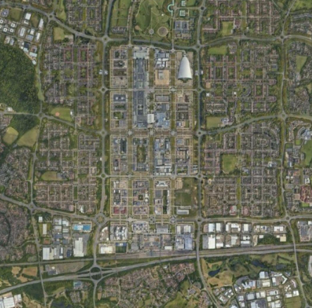
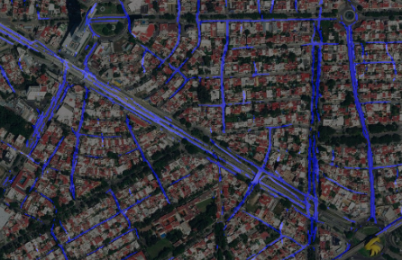
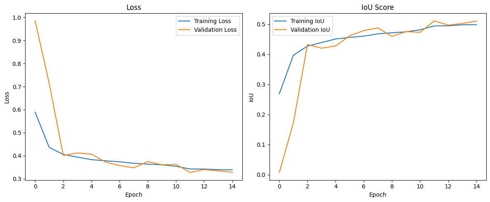

# Project Title: RoadCraft
  

Input                      |  Output
:-------------------------:|:-------------------------:
    |   

## Description
**Problem Statement(voluntary)**:   
Accurate and efficient road detection from aerial imagery remains a critical challenge in urban planning, disaster response, and autonomous navigation. Traditional methods often rely on manual annotation or computationally expensive techniques, limiting scalability and real-time applicability. As a team, we voluntarily selected this problem to develop such an user-friendly automated platform which can annotate in real-time.   
So we developed **RoadCraft**,  which is a web-based application for segmentation of roads from aerial images using the encoder-decoder based deep learning model `U-Net`. Built with `FastAPI` and a responsive Bootstrap front-end, it allows users to upload images and visualize road annotations in real-time. The project leverages the 'Massachusetts Roads Dataset' and integrates advanced segmentation techniques for aforementioned real-world applications. A lot of research has happened in relation to road information extraction from aerial imagery. Still it remains a challenging task due to noise, complex Image background and occlusions.
 
Current technologies like Google Maps depend on manual labor to annotate and maintain their maps. Our project seeks to streamline this process by automating road detection in such maps, which demand regular updates and verification.

### [Demo](static/demo2.gif)

## Contents

### Dataset
- **Source**: ([Massachusetts Roads Dataset](https://www.kaggle.com/datasets/insaff/massachusetts-roads-dataset)).
- **Structure**: 
  - Training images: Aerial RGB images (e.g., `tiff/train/`).
  - Training masks: Binary road masks (e.g., `tiff/train_labels/`).
- **Size**: Approximately 1,100+ image-mask pairs.
- **Resolution**: Original images resized to 512x512 for training and inference.

### Tools and Libraries
- **Python**: 3.10+
- **Frameworks**:
  - TensorFlow 2.16.1: Model building and training.
  - FastAPI 0.95.1: Backend API.
  - Uvicorn 0.21.1: ASGI server.
- **Libraries**:
  - OpenCV (opencv-python 4.7.0.72): Image processing.
  - NumPy 1.24.3: Numerical operations.
  - Segmentation Models 1.0.1: U-Net utilities (EfficientNet backbone).
  - Albumentations: Data augmentation (DeepLabV3+).
  - Jinja2 3.1.2: Templating for front-end.
  - Bootstrap 5.1.3: Front-end styling.
- **Full List**: See `requirements.txt`.

### Data Preprocessing
  - **Loading**: Images and masks loaded with OpenCV (`cv.imread`).
  - **Resizing**: Resized to 512x512 using `cv.resize` (INTER_CUBIC for images, INTER_NEAREST for masks).
  - **Mask Conversion**: Binary masks (0 or 255) via thresholding (U-Net: `pred > 0.5`, DeepLab: `mask >= 100`).
  - **Normalization**: Images scaled to [0, 1] (`img.astype(np.float32) / 255.0`).

### Model Architecture
- **U-Net**:
  - **Type**: Encoder-decoder network.
  - **Input**: 512x512x3 RGB images.
  - **Output**: 512x512x1 binary mask (sigmoid activation).
  - **Backbone**: Likely EfficientNet (from `segmentation-models`), pre-trained on ImageNet.
  - **Metrics**: Dice coefficient, IoU score, Dice loss.

### Training and Evaluation
- **Common for both architectures**:
  - **Dataset Split**: 90% training, 10% validation (via `train_test_split`).
  - **Batching**: Batch size of 4.
  - **Epochs**: 15
  - **Metrics**: Dice coefficient, IoU score, Dice loss.

### U-NET                      
  
  
### References
* **U-Net: Convolutional Networks for Biomedical Image Segmentation** - Olaf Ronneberger, Philipp Fischer, Thomas Brox (2015) - [https://arxiv.org/abs/1505.04597](https://arxiv.org/abs/1505.04597)
* **Road Segmentation in Aerial Images by Exploiting Road Vector Data** - Jiangye Yuan, Anil M. Cheriyadat (2013) - [http://jiangyeyuan.com/papers/YC13_ComGeo.pdf](http://jiangyeyuan.com/papers/YC13_ComGeo.pdf)
* **Road Segmentation in SAR Satellite Images with Deep Fully-Convolutional Neural Networks** - Corentin Henry, Seyed Majid Azimi, Nina Merkle (2018) - [https://www.researchgate.net/publication/386976934_Road_Segmentation_in_SAR_Satellite_Images_with_Deep_Fully-Convolutional_Neural_Networks](https://www.researchgate.net/publication/386976934_Road_Segmentation_in_SAR_Satellite_Images_with_Deep_Fully-Convolutional_Neural_Networks)
* **Tensorflow** - [https://www.tensorflow.org/](https://www.tensorflow.org/)
* **Albumentations** - [https://github.com/albumentations-team/albumentations](https://github.com/albumentations-team/albumentations)
* **Segmentation Models** - [https://github.com/qubvel/segmentation_models](https://github.com/qubvel/segmentation_models)
