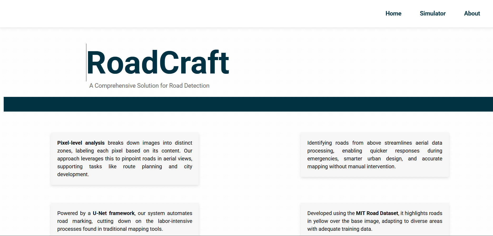
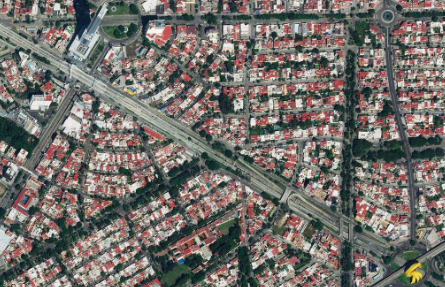

# Project Title: RoadCraft
  

Input                      |  Output
:-------------------------:|:-------------------------:
    |   

## Description
RoadCraft is a web-based application for segmentation of roads from aerial images using two deep learning models: U-Net and DeepLabV3+. Built with FastAPI and a responsive Bootstrap front-end, it allows users to upload images, select a model (U-Net or DeepLabV3+) via a dropdown, and visualize road annotations in real-time. The project leverages the Massachusetts Roads Dataset and integrates advanced segmentation techniques for urban planning, mapping, and emergency response applications.

## Contents

### Dataset
- **Source**: Massachusetts Roads Dataset (available on [Kaggle](https://www.kaggle.com/datasets/insaff/massachusetts-roads-dataset)).
- **Structure**: 
  - Training images: Aerial RGB images (e.g., `tiff/train/`).
  - Training masks: Binary road masks (e.g., `tiff/train_labels/`).
- **Size**: Approximately 1,100+ image-mask pairs.
- **Resolution**: Original images resized to 512x512 for training and inference.

### Tools and Libraries
- **Python**: 3.10+
- **Frameworks**:
  - TensorFlow 2.16.1: Model building and training.
  - FastAPI 0.95.1: Backend API.
  - Uvicorn 0.21.1: ASGI server.
- **Libraries**:
  - OpenCV (opencv-python 4.7.0.72): Image processing.
  - NumPy 1.24.3: Numerical operations.
  - Segmentation Models 1.0.1: U-Net utilities (EfficientNet backbone).
  - Albumentations: Data augmentation (DeepLabV3+).
  - Jinja2 3.1.2: Templating for front-end.
  - Bootstrap 5.1.3: Front-end styling.
- **Full List**: See `requirements.txt`.

### Data Preprocessing
- **Common Steps**:
  - **Loading**: Images and masks loaded with OpenCV (`cv.imread`).
  - **Resizing**: Resized to 512x512 using `cv.resize` (INTER_CUBIC for images, INTER_NEAREST for masks).
  - **Mask Conversion**: Binary masks (0 or 255) via thresholding (U-Net: `pred > 0.5`, DeepLab: `mask >= 100`).
- **U-Net Specific**:
  - Normalization: Images scaled to [0, 1] (`img.astype(np.float32) / 255.0`).
- **DeepLabV3+ Specific**:
  - Normalization: MobileNetV2 preprocessing (`tf.keras.applications.mobilenet_v2.preprocess_input`), scales to [-1, 1].
  - Augmentation: Horizontal flip (p=0.5), blur (p=0.85, limit=5) via Albumentations.

### Model Architecture
- **U-Net**:
  - **Type**: Encoder-decoder network.
  - **Input**: 512x512x3 RGB images.
  - **Output**: 512x512x1 binary mask (sigmoid activation).
  - **Backbone**: Likely EfficientNet (from `segmentation-models`), pre-trained on ImageNet.
  - **Metrics**: Dice coefficient, IoU score, Dice loss.

- **DeepLabV3+**:
  - **Type**: Encoder-decoder with Atrous Spatial Pyramid Pooling (ASPP).
  - **Backbone**: MobileNetV2, pre-trained on ImageNet.
  - **Components**:
    - ASPP with dilation rates [1, 6, 12, 18] for multi-scale feature extraction.
    - Decoder with upsampling and concatenation of low-level features.
  - **Input**: 512x512x3 RGB images.
  - **Output**: 512x512x1 binary mask (sigmoid activation).
  - **Metrics**: Dice coefficient, IoU score, Dice loss.

### Training and Evaluation
- **Common for both architectures**:
  - **Dataset Split**: 90% training, 10% validation (via `train_test_split`).
  - **Batching**: Batch size of 4.
  - **Epochs**: 15(UNET), 8(DeepLabV3+)
  - **Metrics**: Dice coefficient, IoU score, Dice loss.

### UNET                      
  
 
- **DeepLabV3+**:
  
 ...
